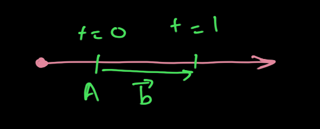
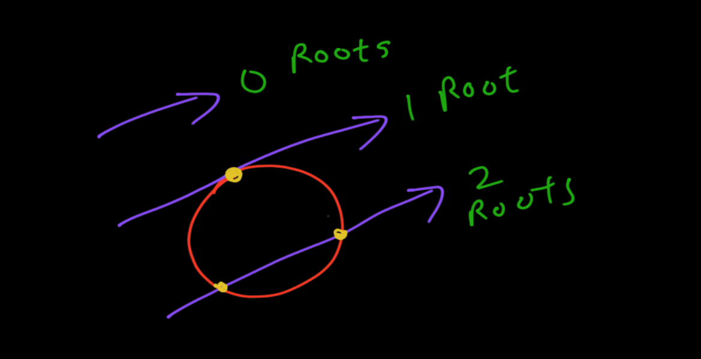

# Notes on ray tracing

## Code structure
- `Vec3` class: 

## PPM files
Reference: https://en.wikipedia.org/wiki/Netpbm

The P6 image format works the following way:

```
P3 

C R
MAX_COLOR
R G B R G B R G B
....
```

Where `C` is amount of columns, `R` is amount of rows. `MAX_COLOR` is the set to 255 usually.

## Rays
To render a scene using a tracer, all of the rays, which spawn from a specific light source, must be traced at every position in the 3D space. A computation of what color is seen at every position must also take place, to color the scene.

The ray can be thought of as a function $P(t) = A + tb$ where $P$ is the position of the ray, $A$ is the origin and $b$ is ray's direction. $P$ moves along the ray for all real values of $t$. The parts in 'front' of the ray are obtained for all positive $t$ and constructs, what we call a _ray_.



As said, the tracer sends rays through pixels and computes colors that are seen at every pixel. The steps are as follows:

1. Calculate ray from the eye to pixel.
2. Determine the objects which the ray intersects.
3. Compute a color for the intersection point.


### Scene: Blending colors 
To create a gradient background, we can make a function that blends colors together to give a us smooth gradient. We can achieve this using linear interpolation.

$blendedValue = (1 - t) \cdot startValue + t \cdot endValue$

When $t = 0.0$, we'd like blue color. When $t = 1.0$, we'd like white color. Everywhere in between, we'd like a blend that varies, according to the $y$ co-ordinate in this case, because we would like a vertical gradient.

The result is:


## Spheres
A sphere is generally used in ray tracing to showcase object intersections. The maths works as follows:

A sphere of radius R, centered at the origin has the equation 
$x^2 + y^2 + z^2 = R^2$. There are three cases that spawn from this:

1. If point is _on_ the sphere: $x^2 + y^2 + z^2 = R^2$
2. If point is _inside_ the sphere $x^2 + y^2 + z^2 < R^2$
3. If point is _outside_ the sphere $x^2 + y^2 + z^2 > R^2$

If $C$ is the center and its co-ordinates are $(C_x, C_y, C_z)$, then the equation becomes $(x-C_x)^2 + (y-C_y)^2 + (z-C_z)^2 = r^2$.

For any point $P = (x, y, z)$, the vector $(P-C)$ is the vector from center $C$ to the point. Consider the dot product of $(P-C)$ with itself.

$(P-C) \cdot (P-C) = (x - C_x)^2 + (y - C_y)^2 + (z - C_z)^2$

Thus, if $P$ happens to be on the sphere, then the equation is satisfied for the sphere and indeed $(P-C)\cdot(P-C) = r^2$.

### Ray-Sphere intersection
Equation of ray: $P(t) = A + tb$

If our ray ever hits the sphere, intersecting it, then $P(t) = P$. Thus, there exists a $t$ that satisfies the sphere equation.

For such a case where $P(t) = P$, 

$(P(t) - C) \cdot (P(t) - C) = r^2$

$\therefore (A + tb - C) \cdot (A + tb - C) = r^2$

$\therefore t^2 (b \cdot b) + 2t (b\cdot(A - C)) + (A - C) \cdot (A - C) - r^2 = 0$


Which is a quadratic equation. We can solve this equation for $t$ which would result in two real solutions, one real solution or no real solutions. This is explained graphically as follows:



**Some optimisations**: 
1. A vector dotted with itself is equal to its squared length.
2. Since $b = 2 * OC \cdot \vec{b}$, where $\vec{b}$ is the direction of the ray, we can use a simple substitution $b = 2h$, which leads to the following:

$$\frac{-b \pm \sqrt{b^2 - 4ac}}{2a} \Rightarrow \frac{-h \pm \sqrt{h^2 - ac}}{a}$$

This leads to slightly cleaner code.

- $t$ values can be restricted to a range $[t_{min}, t_{max}]$.

### Surface normals
Any vector that is normal to the surface of the sphere points outward and has the equation $P - C$.

We can visualize the normals with a color map. We map each component of the vector $P -C$ in the interval $[0,1]$ and then map $x \mapsto r$, $y \mapsto g$ and $z \mapsto b$.

Combining the two things said above, we get the following:


## Antialiasing
## Diffuse materials
Diffusive materials are materials that diffuse light rays in every direction instead of just reflecting them in a single direction. Also called as matte materials. The reflected ray's light is attenuated.

For ray tracers, this means having to randomize the direction of the reflected rays. We can randomize the directions at any angle in the hemisphere created by the surface tangent. The hemisphere is shown in *yellow* in the diagram below.


A better trick exists:

1. Assume an imaginary sphere of unit radius outside of the sphere. This sphere has the center $P + \vec{n}$, where $P$ is the hit point and $\vec{n}$ is the normal vector.
2. Let $S$ be a random point inside of this imaginary sphere.
3. Send a ray from the hit point $P$ to point $S$. Since $S$ itself is randomized, this ray's vector, $S - P$, is also randomized, thus achieving our goal.

Note: $P - \vec{n}$ exists _inside_ the sphere.


### Accurate color intensity
We can use gamma correction to produce accurate colors, because most image viewers assume that images are gamma corrected. This means our images would look lighter. 

We use a gamma factor of 2 in our ray tracer, which means that color components are raised to $\frac{1}{2}$, which is just the square root.

---
### Question: Why and how do shadows form on surfaces? 


---
## Reflectance and scatter
For Lambertian surfaces, we can just scatter and attenuate by reflectance $R$, or scatter with no attenuation but absorb the fraction $1 - R$ of rays. We reject any scattered rays that have zero component in any direction, because they present some weird graphical glitches.

For reflective surfaces, the rays are no longer randomly scattered, but are governed by mathematical rules. The direction of the reflected ray is $v + 2b$ where $v$ is the incoming ray and $b$ is the surface normal.

**Intuition**:

Let $E$ be the incident ray. Let $R$ be the reflected ray. Let $A$ be the component of $E$ parallel to reflective surface and $B$ be the component of $E$ perpendicular to the surface. Then,

$$E = A + B$$
$$R = A - B$$

Since $B$ is the component of $E$ perpendicular to the surface, its magnitude must be equal to the dot product of $E$ and surface normal vector $\hat{n}$. $B$ must also point in the direction of either $\hat{n}$  or $-\hat{n}$.

$$B = (E \cdot \hat{n})\hat{n}$$

Substitute $B$ into $E$ and $R$,

$$E = A + (E \cdot \hat{n})\hat{n}$$
$$R = A - (E \cdot \hat{n})\hat{n}$$

Readjusting gives,

$$R = E - 2(E \cdot \hat{n})\hat{n}$$

Which is the equation we needed.

The negative sign is due to the surface normal vector facing inwards.


## Refraction
Refraction is described by Snell's law. 

If $\theta$ and $\theta'$ are the angles from the normal, and $\eta$ and $\eta'$ are the refractive indices, then,

$$\eta \cdot \sin{\theta} = \eta' \cdot \sin'{\theta}$$


Since the refracted ray is $\mathbf{R'}$
$$ \mathbf{R'} = \mathbf{R'}_{\bot} + \mathbf{R'}_{\parallel}$$

If we solve for $\mathbf{R'}_{\bot}$ and $\mathbf{R'}_{\parallel}$, we  have: 

$$\mathbf{R'}_{\bot} = \frac{\eta}{\eta'}(\mathbf{R} +  \cos{\theta n})$$

$$\mathbf{R'}_{\parallel} = - \sqrt{1 - |\mathbf{R'_{\bot}}|^2}\mathbf{n}$$


We can also rewrite $\mathbf{R'}_{\bot}$ as,

$$\mathbf{R'}_{\bot} = \frac{\eta}{\eta'}(\mathbf{R} + (-\mathbf{R} \cdot \mathbf{n}) \mathbf{n} )$$


Thus, $\mathbf{R}$ becomes, 

$$\boxed{\mathbf{R} = \left(\frac{\eta}{\eta'}(\mathbf{R} + (-\mathbf{R} \cdot \mathbf{n}) \mathbf{n})\right) - \sqrt{1 - |\mathbf{R'_{\bot}}|^2}\mathbf{n}}$$


Which is the `refract_ray` function included in `vector.rs`.
